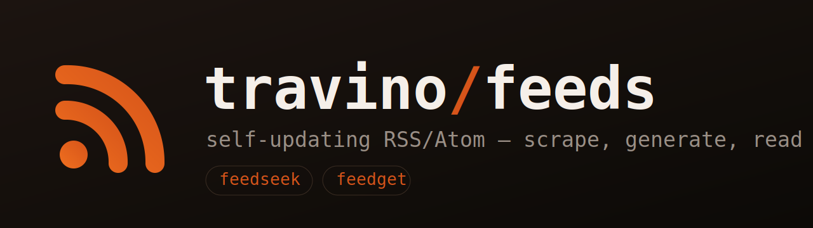

<div align="center">



**Producent i konsument feedów w jednym monorepo.** Scrapuje strony bez RSS, generuje Atom,
publikuje na GitHub Pages i czyta — w przeglądarce albo natywnym widżecie na Androida.

[](https://github.com/trvny/feeds/actions/workflows/update-feeds.yml)
[](https://trvny.github.io/feeds/)
[](feedseek/feeds.yaml)
[](https://github.com/trvny/feeds/commits/main)
[](LICENSE)

[**📡 Strona**](https://trvny.github.io/feeds/) · [**📖 Czytnik**](https://trvny.github.io/feeds/reader/) · [**🗂 Rejestr feedów**](feedseek/feeds.yaml)

</div>

---

## 📦 Co siedzi w środku

|  |  [`feedseek/`](feedseek/) |  [`kanarek/`](kanarek/) |
|---|---|---|
| **co to robi** | generatory **RSS/Atom** — scrapują strony bez natywnego feeda, CI odświeża co 2 h, wynik leci na GitHub Pages + statyczny czytnik OPML | natywny **widżet + apka na Androida** do czytania feedów, plus worker `RSS→JSON` na krawędzi |
| **stack** |   |    |

Oba robią to samo — `strona → Atom` — tylko z dwóch stron:
`feedseek` **wsadowo w CI**, `kanarek/worker` **on-demand na krawędzi** (`/discover` + `/scrape`).

## ⚙️ Jak to działa

```text
                  feeds.yaml (53 źródła)
                         │
   ┌─────────────────────┴─────────────────────┐
   │  feedseek — GitHub Actions, co 2 h         │
   │  scrape → parse → dedup → Atom XML          │
   └─────────────────────┬─────────────────────┘
                         │  publish
                         ▼
          trvny.github.io/feeds/  ──▶  /reader/  (czytnik OPML)
                         │
                         │  konsumpcja
                         ▼
          kanarek — widżet/apka Android  ◀──  worker (RSS→JSON)
```

- **Izolacja błędów** — jedno padnięte źródło nie blokuje reszty.
- **Hash-gated `updated`** — feed nie „mieli" gdy wpis się nie zmienił.
- **Dedup** po znormalizowanym URL-u i tytule (cross-source).
- **Bot-protection** — `curl_cffi` + impersonacja Chrome ogarnia Cloudflare/Akamai/DataDome.

## 🚀 Szybki start

```bash
# wygeneruj pojedynczy feed lokalnie
cd feedseek/feed_generators
RSS_REPO_SLUG=trvny/feeds python3 <generator>.py --full

# waliduj wszystkie XML-e
python3 validate_feeds.py
```

Dodanie nowego feeda: generator w `feedseek/feed_generators/`, wpis w
[`feedseek/feeds.yaml`](feedseek/feeds.yaml), cel w `Makefile` — resztę (XML + cache)
dorobi CI przy następnym przebiegu.

## 🗂 Struktura

```text
feeds/
├── feedseek/          # generatory RSS/Atom + statyczny czytnik
│   ├── feed_generators/
│   ├── feeds.yaml     # rejestr źródeł
│   ├── feeds/         # wygenerowane XML-e (CI)
│   └── site/          # build_site.py + reader.html
├── kanarek/           # apka Android + Cloudflare Worker
└── .github/workflows/ # CI obu projektów (przez working-directory)
```

· historia obu projektów (`feeds` + `kanarek`) zachowana po konsolidacji do monorepo.

## 📄 [Licencja](LICENSE)


